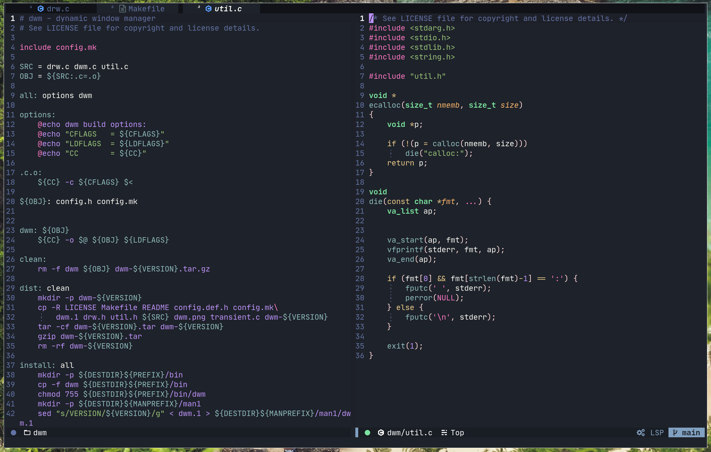

# My Nvim Story
Inspired by early version of [NvChad](https://github.com/NvChad/NvChad) story 

#keymaps

## Window
| key           | Action                                         |
|---------------|------------------------------------------------|
| <leader> wa   | vertical split                                 |
| <leader> ws   | horizontal split                               |
| <leader> wm   | maximize window                                |
| <leader> wh   | go to left window                              |
| <leader> wj   | go to bottom window                            |
| <leader> wk   | go to top window                               |
| <leader> wl   | go to right window                             |
| <leader> wc   | close window (not buffer)                      |
| <leader> wth  | move window to max left                        |
| <leader> wtj  | move window to max bottom                      |
| <leader> wtk  | move window to max top                         |
| <leader> wtl  | move window to max right                       |

## Buffer
| key           | Action                                         |
|---------------|------------------------------------------------|
| <leader> bc   | close buffer                                   |
| <leader> bs   | save buffer                                    |

## File Navigation 
| key           | Action                                         |
|---------------|------------------------------------------------|
| <leader> ff   | find file                                      |
| <leader> fs   | Grep for string                                |
| <leader> fw   | Grep for word                                  |
| <leader> fb   | find buffer                                    |
| <leader> fh   | find help                                      |
| <leader> fm   | find mark 									 |
| <leader> fh   | find help                                      |
| <leader> fn   | browse files 									 |
| <leader> fa   | find files for android dev 					 |
| <leader> fg   | git files 				  					 |

## Debugging 
| key           | Action                                         |
|---------------|------------------------------------------------|
| <leader> dr   | initialize debug asking for debugable program  |
| <leader> dg   | go to gdb window (:Gdb)                        |
| <leader> dp   | go to Program window (:Program)                |
| <leader> ds   | go to Source window (:Source)                  |
| <leader> da   | go to Asembly window (:Asm)                    |
| <leader> d=   | back to original window layout 				 |
| <leader> db   | set breakpoint	                             |
| <leader> dl   | unset breakpoint                         		 |
| ,c     		| (gdb) continue 								 |
| ,n   			| (gdb) next	 								 |
| ,s   			| (gdb) step 	 								 |


## Run code
| key           | Action                                         |
|---------------|------------------------------------------------|
| <leader> ra   | Run Android Project						     |
| <leader> rn   | Run norminette							     |
| <leader> rmm  | Run :make									     |
| <leader> rmc  | Run :make clean							     |
| <leader> rmf  | Run :make	fclean							     |
| <leader> rmr  | Run :make	fclean all						     |

## Others
| key           | Action                                         |
|---------------|------------------------------------------------|
| <leader> ot  	| Open terminal in foalting window(Esc to esacpe)|
| <leader> y	| Copy to system clipboard						 |
| <leader> Y	| Copy current line to system clipboard			 |

# Commands
```
:Gcc [ARGS VALUES]
```
ARGS VALUES : arguments for ur program

```
:GccWall [ARGS VALUES]
```
ARGS VALUES : arguments for ur program

```
:Inspect [Lua Data Type]
```
# Showcase



